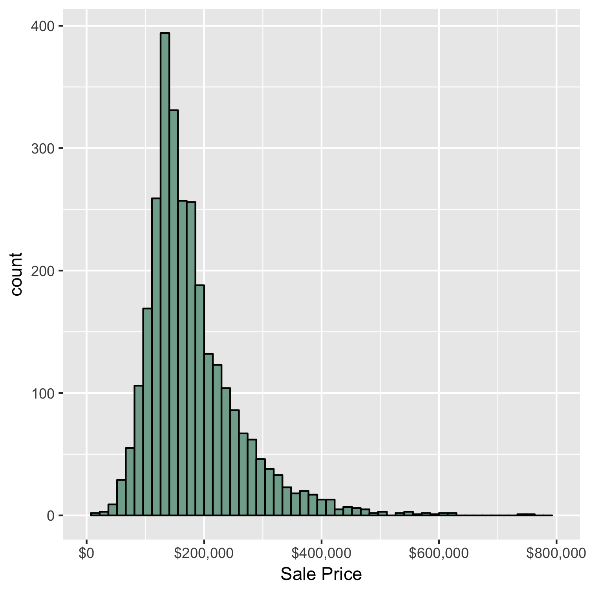

```{r setup, include=FALSE}
knitr::opts_chunk$set(echo = TRUE)
library(tidyverse)
library(stargazer)
library(pls)
library(scales)
```

# Intro

The 2008 financial crisis affected the lives of everyone in the United States---some more than others---and there is an abundance of retrospective research that seeks to identify which sectors of the economy were hit hardest during this time and why. The first sector that comes to mind is housing as the financial crisis was "characterized by a rise in subprime mortgage delinquencies and foreclosures, and the resulting decline of securities" backed by these subprime mortgages.[1] For this reason, we decided to use our multifaceted data science toolbox to answer meaningful questions about the housing market. The goal of this project is ultimately to build a regression model to predict defined outcomes. So, while we will not be analyzing the housing market from an economic perspective like the majority of the literature, we can offer up a predictive model for academic purposes. 

As a conceptual framework for our research, we adopted Peng and Matsui's epicycles of analysis to iteratively manage the steps of our data analysis.[2] After choosing the broad topic of the housing market, we narrowed the scope of our research. This included brainstorming as a team to figure out what specific question we wanted to answer about the housing market. We unanimously decided to predict the sale price of a residential house sale based on common characteristics that a property appraiser or assessor's office would use to assess property value. 

**Maybe add small lit review section here**

## The Dataset

```{r loaddata, echo = FALSE}
df <- read.csv("cleaned_housing.csv", header = TRUE)
df_train <- read.csv("train_housing.csv", header = TRUE)
df_test <- read.csv("test_housing.csv", header = TRUE)
```

The dataset we chose for our project contains information from the Ames Assessor’s Office on residential property sales that occurred in Ames, Iowa from 2006 to 2010.[3] The dataset was published in the *Journal of Statistics Education* for students and researchers alike to have an opportunity to practice predictive modeling on messy, real world data. The dataset contains 2930 observations of 80 variables and the unit of observation is a single property sale in Ames, Iowa in a given year.

Of the 80 variables, 23 are nominal, 23 are ordinal, 14 are discrete, and 20 are continuous. The variables included are basic characteristics that anyone wanting to buy a house would be interested in. For the most part, the different variables may be split up into specific groups. In general, the 20 continuous variables relate to  measurements of area dimensions for each observation. These include, among others, the sizes of lots, rooms, porches, and garages. The 14 discrete variables mostly have to do with the number of bedrooms, bathrooms, kitchens, etc. that a given property has. There are several geographic categorical variables that start profiling properties at the individual Parcel ID level and end at the neighborhood level. The rest of the nominal variables identify characteristics of the property and dwelling type/structure. Most of the ordinal variables are rankings of the quality/condition of rooms and lot characteristics. For more information on the variables in the dataset, consult the included `DataDescription.txt` file.

The dataset was fairly messy with regard to the number of missing values and the way levels of categorical variables were organized and coded. In order to tackle the large amount of cleaning required, we thought it was best to split the data into four equal parts---leaving about 20 variables for each team member to clean. So, we changed all variable names to lowercase as some were upper case to standardize them and divided the variables up accordingly. 

There were 13960 missing values in the dataset when we started to clean and analyze it. *Table 1* breaks down the number of missing values by variable. After analyzing the variables with missing data and consulting the aforementioned `DataDescription.txt` file, we noticed that most of the missing values were actually not missing. The documentation states the data curator coded certain variables as `NA` to specify that a house did not have that feature. For example, in the case of the `alley` variable, `NA` means there is `No Alley` access to the property. By recoding these variables, we were able to fix most of the missing values in categorical variables.  

Variable Name   | Number of Missing Values
----------------|-------------------------
pool.qc         | 2917
misc.feature    | 2824         
alley           | 2732 
fence           | 2358
fireplace.qu    | 1422 
lot.frontage    | 490  
garage.yr.blt   | 159 
garage.qual     | 158
garage.cond     | 158   
garage.type     | 157
garage.finish   | 157   
bsmt.qual       | 79
bsmt.cond       | 79
bsmt.exposure   | 79
bsmtfin.type.1  | 79 
bsmtfin.type.2  | 79 

Table: Table 1: Number of Missing Values by Variable, Number Missing > 75

The solution to fill missing values for quantitative variables was just as simple. Most of the quantitative variables missing large numbers of values were `NA` because a given house feature was missing as well. For example, all missing values in the `garage.yr.blt` variable were because the house does not have a garage. The same reasoning for missing values applies to the square footage variables. For variables that were not missing a large number of variables we used mode (categorical) and median (quantitative) imputation to fill missing values.

Once the variables were cleaned and all missing values were filled, we performed exploratory data analysis of the data. We noticed that the distribution of sale price was heavily skewed to the right. This can be seen in the following graph.  These high-end outliers will make it very difficult to accurately predict as they are significantly going to drive up the root mean square error (RMSE) of our predictions. Keeping these observations would have disproportionately penalized the predictions of our model. To remedy this issue, we thought of two possible solutions: 1) drop the outlier observations; or 2) linearly transform the saleprice variable by taking the natural logarithm. We ultimately decided to drop the top and bottom one percent of observations as our goal is to predict *typical* sales in Ames, Iowa. Taking the natural logarithm of the sale price would change the scale of our predictions to a logarithmic scale and would abstract the interpretability of model predictions. In total, we only dropped 58 observations by excluding the top and bottom one percent of sale price. 

The cleaned dataset has 2838 observations of 82 variables. This means that we only dropped 92 observations (3.14% of the original data) throughout the cleaning process. After cleaning the data, we used the `caret` package's `creatDataPartition` function to split our cleaned dataset into a train and test set. We decided to split 70 percent of the data into train and the remaining 30 percent into test. The three resulting datasets---cleaned, train, and test---can be found in the included project repository or generated by running the included `cleaning.rmd` as we set the seed to allow for reproducibility. 

[1]: http://www.stat.unc.edu/faculty/cji/fys/2012/Subprime%20mortgage%20crisis.pdf
[2]: cite the *Art of Data Science Book* here
[3]: *Journal of Statistics Education*, Volume 19, Number 3(2011), accessed April 11, 2017 at www.amstat.org/publications/jse/v19n3/decock.pdf

# Regression Model Approach 1 - Jack

# # Model Creation and Evaluation

We decided to begin our model development process by generating several simple models. Linear models are the first models chosen to examine as they are the easiest to fit. The first model we decide to create was a linear regression model containing all the predictors in the data set. 


```{r Kitchen Sink Model}
all.model <- lm(saleprice ~ ., data = train)
summary(all.model)
plot(all.model)
pred.all <- predict(all.model, test)
RMSE.all <- sqrt(mean((pred.all - test_y)^2))
RMSE.all
```

The RMSE of the full model is 30198.86. The summary shows several instances of perfect multicollinearity and many variables appear to be statistically insignicant. The plotting of the model shows several outliers that significantly affect the fitting of the model. All variables that are demostrate perfect multicollinearity or have a p-value > 0.2 are dropped to reduce dimensionality and include only significant variables. The reduced model is run the model again to see if this reduction with improve RMSE.    

```{r Model 2}
model.2 <- lm(saleprice ~ ms.zoning + lot.area + street + land.contour + land.slope + neighborhood + condition.1 + condition.2 + bldg.type + house.style + overall.qual + overall.cond + year.built + roof.style + exterior.1st + exterior.2nd + mas.vnr.type + mas.vnr.area + exter.qual + bsmt.qual + bsmt.exposure + bsmtfin.sf.1 + bsmtfin.sf.2 + bsmt.unf.sf + heating.qc + x1st.flr.sf + x2nd.flr.sf + bsmt.full.bath + bsmt.half.bath + full.bath + bedroom.abvgr + functional + fireplaces + fireplace.qu + garage.yr.blt + garage.cars + garage.area + wood.deck.sf + enclosed.porch + screen.porch + misc.feature + sale.type + sale.condition + ln.lot.frontage + ln.lot.area, data = train)
summary(model.2)
plot(model.2)
pred.2 <- predict(model.2, test)
RMSE.2 <- sqrt(mean((pred.2 - test_y)^2))
RMSE.2
```

The RMSE of reduced model is 30200.18, an increase from the full model, and perfect multicollinearity has been removed. There are still several outliers with high residuals, but the leverage of the outliers has reduced. The model is furthur simplified to see if this trend continues as simplifcation increases.  
```{r Model 3}
model.3 <- lm(saleprice ~ overall.qual + neighborhood + bldg.type + bsmt.qual + total.bsmt.sf + gr.liv.area + full.bath + half.bath + totrms.abvgrd + kitchen.qual + garage.qual + garage.area + wood.deck.sf + screen.porch + misc.feature, data = train)
summary(model.3)
plot(model.3)
pred.3 <- predict(model.3, test)
RMSE.3 <- sqrt(mean((pred.3 - test_y)^2))
RMSE.3
```

```{r Model Simple}
model.4 <- lm(saleprice ~ overall.qual + total.bsmt.sf + gr.liv.area + totrms.abvgrd, data = train)
summary(model.4)
plot(model.4)
pred.4 <- predict(model.4, test)
RMSE.4 <- sqrt(mean((pred.4 - test_y)^2))
RMSE.4
```

```{r Model Very Simple}
model.5 <- lm(saleprice ~ overall.qual + gr.liv.area, data = train)
summary(model.5)
plot(model.5)
pred.5 <- predict(model.5, test)
RMSE.5 <- sqrt(mean((pred.5 - test_y)^2))
RMSE.5
```

With further simplication, the RMSE continues to increase, as does the leverage of the outliers. The residuals are larger on the ends of the sale price range, demonstrating the poor predictive nature of the linear regression model for the data set. A stepwise regression using backward elimination to run to find the model with the lowest AIC.   

```{r Stepwise Backward}
step.back.model <- step(all.model, direction = "backward")
summary(step.back.model)
pred.test.back <- predict(step.back.model, newdata = test)
RMSE.back <- sqrt(mean((pred.test.back - test_y)^2))
RMSE.back
```

The stepwise backwards reduces the RMSE from the simplified models but is still producing worse results that the full model. A stepwise regression with forward selection is run to see if this process will create a better fitting model.  

```{r Stepwise Forward}
step.forward.model <- step(all.model, direction = "forward")
summary(step.forward.model)
pred.test.forward <- predict(step.forward.model, newdata = test)
RMSE.forward <- sqrt(mean((pred.test.forward - test_y)^2))
RMSE.forward
```

The forward selection model improves on the backwards elimination model and results the same RMSE as the full model.

Multiple linear regression has been demonstrated to not be the best method for model creation for this data set. This is a result of assumptions that a linear regression makes about the dataa that this data set does not conform to. Linear regression first assumes a linear relationship between the explanatory variables and the response variable. The is no evidence of such a relationship with a large number of the predictors in this data set. Next, a linear regression assumes multivariate normality among the explanatory variables. The exploratory data analysis demonstrates clear non-normality from the majority of the predictors. A linear regression also assumes no or little multicollinearity between explanatory variables. This data set contains high levels of multicollinearity as seen in the full model analysis. Finally, a linear regression model assumes homoscedasticity. As can be clearly seen in the EDA, as each explanatory variable increases in value, the variance increases as well, almost uniformily across the data set, indicating clear heteroscedasticity.

To explore other model creation options, a simple decision tree regression is run and cross-validated. 

```{r Decision Tree}
library(tree)

tree_model <- tree(saleprice ~ ., data = train, method = "recursive.partition")
plot(tree_model)
text(tree_model, pretty = 0)
tree_pred <- predict(tree_model, test)
RMSE.tree <- sqrt(mean((tree_pred - test_y)^2))
RMSE.tree

cv_tree <- cv.tree(tree_model)
plot(cv_tree$size, cv_tree$dev, type = "b", xlab = "Tree Size", ylab = "MSE")
cv_tree$size[1]
```

Pruning is not necessary for the tree as cross-validation plot shows that the maximum number of leafs results in the lowest MSE.

The decision tree model has poor predictive capabilities for this housing data. Analyzing the nodes shows that the decision tree only splits into ten leafs and predicts sales prices on very few variables. The decision tree model has an RMSE of 36946.74, higher than three of the linear models, the forward selection model, and the backwards elimination model. 


# Regression Model Approach 2 - Paul
```{r pfb.intro, echo=FALSE, message=FALSE}
train_h.Paul <- df_train
test_h.Paul <- df_test
```
## Real Estate Based-Model
The dataset presents challenges for the exercise of establishing a projected sale price. The large number and wide variety of attributes associated with the sale of a house complicate the process of establishing an understandable model.  After cleaning 83 attributes are associated with each sale.  Multiple attributes are used to characterize the same basic feature.  Many factors are characterized by multiple levels with distinctions that are complicated to value.  My approach was to use conventional Real Estate guidance as a guide for the selection of attributes to build a conventional regression model.  The purpose is to establish a model whose results can be communicated to a home seller and buyer. Communication of the factors that contributed to the model was a key goal.

I started the process with a set of 83 models that mapped each attribute individually against the sale price.  I created a list by adjusted R squared value and sorted it in descending order.  This became my candidate list for the guided attribute selection process.  
The R code is shown below along with the resultant list of variables and the adjusted R squared values. 
```{r pfb.building.ordered.list, warning=FALSE}
df.Paul <- data.frame(Variable = character(ncol(train_h.Paul)), AdjRSquared = numeric(ncol(train_h.Paul)), stringsAsFactors = FALSE)
for(i in 1:ncol(train_h.Paul)) {
  df.Paul$Variable[i]<- labels(train_h.Paul)[[2]][[i]]
  df.Paul$AdjRSquared[i]<- summary(lm(as.formula(paste("saleprice ~", labels(train_h.Paul)[[2]][[i]])),data=train_h.Paul))$adj.r.squared
}
head(df.Paul[order(df.Paul$AdjRSquared,decreasing=TRUE),],20)
```

### Overall Quality
The most prominent attribute is overall.qual.  It rates the overall material and finish of the house.  The values range from Very Poor (1) to Very Excellent (10).  I am a bit suspicious of this variable since it is based on a subjective evaluation by the compiler of the data set. The observed tracking with the sale price of the house as shown in the graph that follows may not be quite coincidental. I have created a regression model with the variable and one without it on the grounds that it may obscure other factors that are more reliably grounded.
```{r pfb overall quality}
plot(train_h.Paul$overall.qual,train_h.Paul$saleprice)
```

### Location. 
The classic real estate refrain says, "location, location, location." The data from Ames, IA provides a single attribute, neighborhood, that stands in for this concept.  Each property is identified by neighborhood.  The graph below shows the impact of neighborhood on housing sale price. I re coded Neighborhood to a factor in an order which reflected the mean sale price.  This allows a clear display of the changes in sale prices as one moves up to what would seem to be the more upscale locations.

```{r pfb.neighborhood}
train_h.Paul$neighborhood <- factor(train_h.Paul$neighborhood, levels = c("MeadowV" ,"IDOTRR" ,"BrDale" ,"OldTown" ,"BrkSide" ,"Edwards" ,"SWISU" ,"Sawyer" ,"NPkVill" ,"Blueste" ,"NAmes" ,"Mitchel" ,"SawyerW" ,"NWAmes" ,"Gilbert" ,"Greens" ,"Blmngtn" ,"CollgCr" ,"Crawfor" ,"ClearCr" ,"Somerst" ,"Timber" ,"Veenker" ,"NridgHt" ,"StoneBr" ,"NoRidge"))
test_h.Paul$neighborhood <- factor(test_h.Paul$neighborhood, levels = c("MeadowV" ,"IDOTRR" ,"BrDale" ,"OldTown" ,"BrkSide" ,"Edwards" ,"SWISU" ,"Sawyer" ,"NPkVill" ,"Blueste" ,"NAmes" ,"Mitchel" ,"SawyerW" ,"NWAmes" ,"Gilbert" ,"Greens" ,"Blmngtn" ,"CollgCr" ,"Crawfor" ,"ClearCr" ,"Somerst" ,"Timber" ,"Veenker" ,"NridgHt" ,"StoneBr" ,"NoRidge"))
ggplot(train_h.Paul, aes(x = neighborhood, y = saleprice)) + 
  geom_boxplot(fill = "#81AC9B") +
  theme(axis.text.x = element_text(angle = 90, size = 8), legend.position = "none") + 
  scale_y_continuous(labels = dollar) 
```

### Living area
The size of the home in terms of square feet is used within the real estate community as a mechanism for the development of lists of comparable houses.  In the cleaned data set the value is shown in the gr.liv.area.   The approximate per sq ft charge in Ames, IA is indicated by the coefficient of the model as approximately $44. 

### Basement
A finished basement has a clear value since by itself is a pretty good predictor of the sale price.  Both the total square feet and the evaluation of the height of the basement ceiling have been kept in the evaluation.  A basement square foot would have an approximate value 0f $21.  Bsmt Qual evaluates the height of the basement.  We have converted this value to a numeric value from 1 to 6 in ascending indications of quality.

       Ex	Excellent (100+ inches)	
       Gd	Good (90-99 inches)
       TA	Typical (80-89 inches)
       Fa	Fair (70-79 inches)
       Po	Poor (<70 inches
       NA	No Basement
```{r pfb.basement}
test_h.Paul$bsmt.qual = as.numeric(factor(test_h.Paul$bsmt.qual, levels = c("No Basement", "Po", "Fa", "TA", "Gd", "Ex")))
train_h.Paul$bsmt.qual = as.numeric(factor(train_h.Paul$bsmt.qual, levels = c("No Basement", "Po", "Fa", "TA", "Gd", "Ex")))
```
### Exterior Condition 
External Quality evaluates the quality of the material on the exterior using a Poor to Excellent scale.  This is subject to some of the same concerns discussed previously under overall.qual. Since first impression often drive sales prices, a factor for external appearance is usefully maintained.
```{r pfb.exter}
test_h.Paul$exter.qual = as.numeric(factor(test_h.Paul$exter.qual, levels = c("Po", "Fa", "TA", "Gd", "Ex")))
train_h.Paul$exter.qual = as.numeric(factor(train_h.Paul$exter.qual, levels = c("Po", "Fa", "TA", "Gd", "Ex")))
```
### Kitchen Condition
Kitchen Quality is a subjective evaluation using a Poor to Excellent rating stored in kitchen.qual,  Real estate agents often cite the lack of new appliances in a kitchen as a price determinant.  Without any other more objective criteria in the model, we have decided to keep it in the final model.
```{r pfb.kitchen}
test_h.Paul$kitchen.qual = as.numeric(factor(test_h.Paul$kitchen.qual, levels = c("Po", "Fa", "TA", "Gd", "Ex")))
train_h.Paul$kitchen.qual = as.numeric(factor(train_h.Paul$kitchen.qual, levels = c("Po", "Fa", "TA", "Gd", "Ex")))
```
### Garage
The number of significant factors in the top price drivers was a surprise.  The importance of garage in determining the sales price may be a cultural artifact of the Ames, IA environment indicating a greater reliance on cars as both a means of transport and a status symbol.  Of the four variables that describe the garages, we have elected to keep two, garage,area and garage.finish.  The garage.cars variable would seem to overlap with the garage.areas and no clear hierarchy exists for the garage.type.

Garage Finish has been converted to a numeric value from 1 to 4 in ascending indications of quality.

       Fin	Finished
       RFn	Rough Finished	
       Unf	Unfinished
       None	No Garage
```{r pfb.garage}
test_h.Paul$garage.finish = as.numeric(factor(test_h.Paul$garage.finish, levels = c("None", "Unf", "RFn", "Fin")))
train_h.Paul$garage.finish = as.numeric(factor(train_h.Paul$garage.finish, levels = c("None", "Unf", "RFn", "Fin")))
```
### Fireplace
Fireplace quality is a more objectively derived attribute than those cited above.  Fireplaces would seem to be a highly prized amenity in Ames, IA. We have converted this value to a numeric value from 1 to 6 in ascending indications of quality.

       Ex	Excellent - Exceptional Masonry Fireplace
       Gd	Good - Masonry Fireplace in main level
       TA	Average - Prefabricated Fireplace in main living area or Masonry Fireplace in basement
       Fa	Fair - Prefabricated Fireplace in basement
       Po	Poor - Ben Franklin Stove
       NA	No Fireplace
```{r pfb.fireplace}
test_h.Paul$fireplace.qu = as.numeric(factor(test_h.Paul$fireplace.qu, levels = c("No Fireplace", "Po", "Fa", "TA", "Gd", "Ex")))
train_h.Paul$fireplace.qu = as.numeric(factor(train_h.Paul$fireplace.qu, levels = c("No Fireplace", "Po", "Fa", "TA", "Gd", "Ex")))
```
### Recently Remodeled
Recent remodeling would seem to be a variable that would tend to indicate the presence of new appliances and updated styles in the property. This value is stored in the cleaned data set as  yrs.since.remod.

### Lot Area
Lot Area is often a component of the property tax calculation and is often an indicator of the expected sale price.  We have included the ln.lot.area within the model to reflect its impact.

### Sale Type
Sale Type have indicators of the nature of the sale.  We're particularly interested in including the embedded indicator of a New house sale that will arguably have a premium.

### Summary
The final models with and without the overall.qual is shown below.  
```{r pfb.model1}
model.Paul<-lm(saleprice~neighborhood +  
    bsmt.qual +  
    total.bsmt.sf +  
    gr.liv.area +  
    exter.qual +   
    kitchen.qual +   
    garage.area +  
    garage.finish +   
    fireplace.qu +  
    yrs.since.remod + 
    ln.lot.area
    , data = train_h.Paul )

model.Paul2<-lm(saleprice~overall.qual +
    neighborhood +  
    bsmt.qual +  
    total.bsmt.sf +  
    gr.liv.area +  
    exter.qual +   
    kitchen.qual +   
    garage.area +  
    fireplace.qu +  
    yrs.since.remod     , data = train_h.Paul )

stargazer(model.Paul, model.Paul2, type="text", style="apsr")
```
The evaluation of model (1) against the train data set is shown below
```{r pfb.testmodel1}
p1.Paul <- predict(model.Paul, test_h.Paul)
d.Paul.p1 <- data.frame(p1.Paul, test_h.Paul$saleprice)
saleprice_MSE.1 <- mean((d.Paul.p1[,1]-d.Paul.p1[,2])^2, na.rm=TRUE)
saleprice_RMSE.1 <- sqrt(saleprice_MSE.1)
saleprice_RMSE.1
```

The evaluation of model (2) against the train data set is shown below
```{r pfb.testmodel2}
Paul2 <- predict(model.Paul2, test_h.Paul)
dPaul.p2 <- data.frame(Paul2, test_h.Paul$saleprice)
saleprice_MSE.1 <- mean((dPaul.p2[,1]-dPaul.p2[,2])^2, na.rm=TRUE)
saleprice_RMSE.1 <- sqrt(saleprice_MSE.1)
saleprice_RMSE.1
```


# Principle Component Regression (PCR) - Yesh

PCR is an application of Principle Component Analysis (PCA) to regression modeling. By creating "components," which are linear transformations of the variables in our dataset, multicollinearity can be minimized by using these components in the regression model, rather than the original variables. This can create a better prediction model, with lower risk of overfitting, than a traditional regression model. However, the ability to interpret the coefficients of the model is lost because each component variable is a linear combination of all the variables in the original dataset.


## Model Generation

```{r dropfactors, echo=FALSE}
df_train_num <- df_train

for(i in colnames(df_train)){
  if(is.factor( df_train[[i]] )){
    df_train_num[[i]] <- NULL
  }
}
```

Because PCR methods work best with numerical data, we first dropped all factor variables from our training dataset, keeping only integer and numerical datatypes. The dataset now contains `r dim(df_train_num)[2]` variables. We then generate a general pcr model using all the variables in the training dataset to predict saleprice.


```{r modelGeneration}
pcr.saleprice <- pcr(saleprice ~ ., data=df_train_num, scale=TRUE, validation="CV")
```

## Model Selection

In order to select the number of components we want to use for prediction, we examine the RMSE vs Number of Components Plot:
```{r rsmeplot}
validationplot(pcr.saleprice)
```

```{r pcrsummary, include=FALSE}
summary(pcr.saleprice)
```

From the summary and the RSME plot, large jumps in the % of variance explained and RSME are observed from 6 to 7 components, and again from 23 to 24. Three Models will be assessed with 1, 7, and 24 components.

## Model Validation

The table below compares the predicted values to the actual values in the test dataset.

```{r modelvaldiation, echo=FALSE}

pcr.predict.1 <- predict(pcr.saleprice, df_test, ncomp=1)
df_predict.1 <- data.frame(pcr.predict.1, df_test$saleprice)
saleprice_MSE.1 <- mean((df_predict.1[,1]-df_predict.1[,2])^2)
saleprice_RMSE.1 <- sqrt(saleprice_MSE.1)

pcr.predict.2 <- predict(pcr.saleprice, df_test, ncomp=7)
df_predict.2 <- data.frame(pcr.predict.2, df_test$saleprice)
saleprice_MSE.2 <- mean((df_predict.2[,1]-df_predict.2[,2])^2)
saleprice_RMSE.2 <- sqrt(saleprice_MSE.2)

pcr.predict.3 <- predict(pcr.saleprice, df_test, ncomp=24)
df_predict.3 <- data.frame(pcr.predict.3, df_test$saleprice)
saleprice_MSE.3 <- mean((df_predict.3[,1]-df_predict.3[,2])^2)
saleprice_RMSE.3 <- sqrt(saleprice_MSE.3)

stargazer(df_predict.1, df_predict.2, df_predict.3, type="text", header=FALSE)
```

Comparing the 3 Models, we see the following RMSE Values when applying the model to the test dataset:

  * Model 1 (1 Component): $`r paste(round(saleprice_RMSE.1))`
  * Model 2 (7 Component): $`r paste(round(saleprice_RMSE.2))`
  * Model 3 (24 Component): $`r paste(round(saleprice_RMSE.3))`

Model 2 appears to be the best, as Model 3 risks overfitting for not a much better fit.


# Random Forest Regression - Mike


